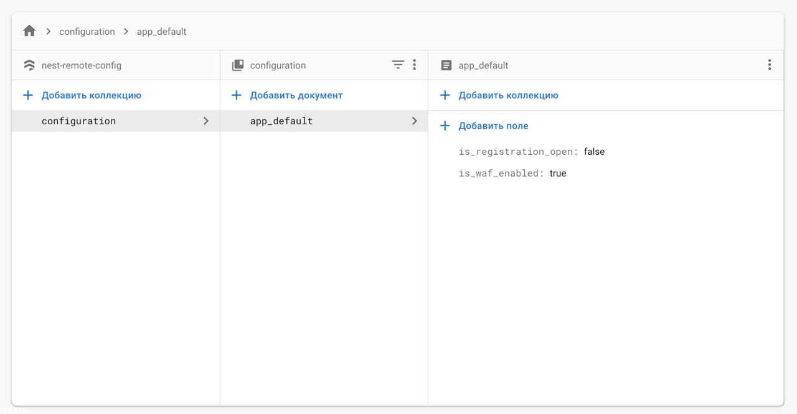

# NestJS-RemoteConfig

The RemoteConfig module could be used when you need share config storage across all your microservices. You can use namespaces to separate config data.

  - Works with Firestore
  - Supports namespaces
  - Native NestJS support

### Requirements!

  - FireStore account
  - [Firebase Service account key](https://firebase.google.com/docs/admin/setup#initialize-sdk)


Install via NPM:
```sh
$ npm i nestjs-remote-firebase-config
```

Export env variable 

```sh
export GOOGLE_APPLICATION_CREDENTIALS=[path-to-your-key.json]
```

Import the package

```ts
import { EStoreType, RemoteConfigModule } from 'nestjs-remote-firebase-config';
```

Then you should registed the package on the top level of the application

```ts
@Module({
    imports: [
        RemoteConfigModule.register({
          store: EStoreType.FIREBASE,
          opts: {}, // opts is not required. could be used instead of env var
        }),
    ],
})
export class AppModule {}
```

### How to set up config variables

First of all, you should be familiar with firebase firestone

[Firestone docs!](https://firebase.google.com/docs/firestore)

> Remote config package by default searches for the `configuration` collection to get all available configs (documents)

*Example of config setup in firestone*



> As soon as you change `configuration` collection documents they will be sync with you application


### Receiving config value

```ts

@Injectable()
export class AppService {
    constructor(
        @Inject('RemoteConfigProviderToken')
        private readonly configService: FirebaseRemoteConfigService,
    )

    method() {
      const param = this.configService.getConfig<Number>('account', 'bonus_amount');
    } 
}


```
